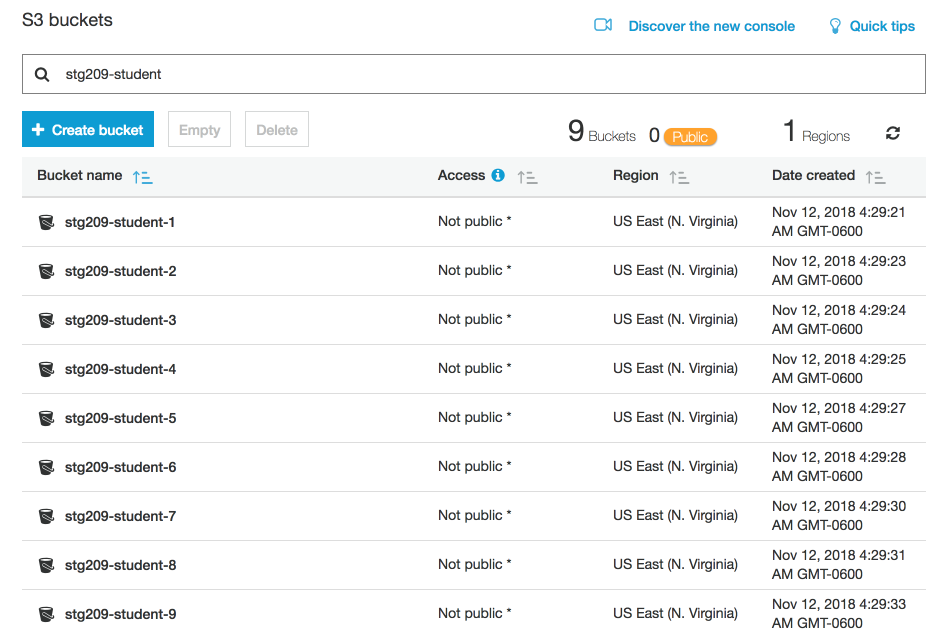
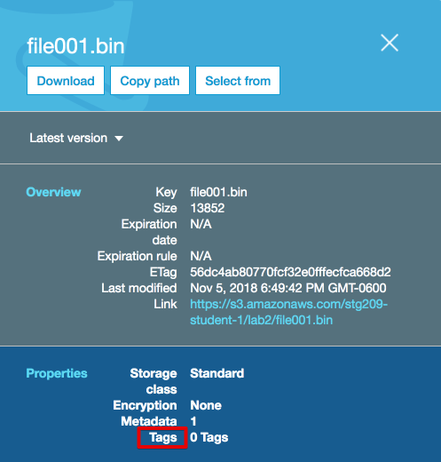
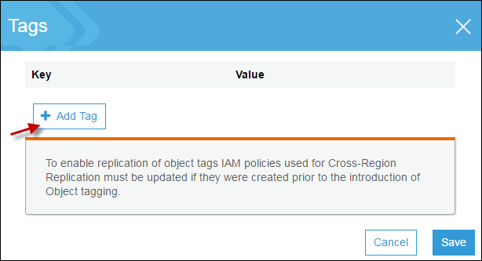

# Lab 1 - Object Tagging and Inventory

## Introduction
This lab will take you through the process of using object tagging, configuring S3 Inventory and viewing an existing inventory.

## Getting Started

### Logging in to the AWS console

1. Right-click on the AWS Console link below and select **open in new tab**

    [AWS Console](https://241417343503.signin.aws.amazon.com/console) 

2. Log into the AWS account using the credentials provided by the presenter

3. Navigate to the S3 Console by selecting **Services -> Amazon S3** at the upper left

4. You should see a list of buckets like this:


5. Each student has _two_ S3 buckets. Unless otherwise specified in the instructions, make sure you use the bucket assigned to you **and without "CRR" in the bucket name. (e.g. make sure to use the bucket with a name like this: stg209-student-1)**

<!--
## Tagging Overview
Use object tagging to categorize storage. Each tag is a key-value pair that can be assigned during initial upload of an object or to an existing object.

 

Note the following:

 * You can associate up to 10 tags with an object. Tags associated with an object must have unique tag keys.

 * A tag key can be up to 128 Unicode characters in length and tag values can be up to 256 Unicode characters in length.

 * Key and values are case sensitive.


In addition to data classification, tagging offers other benefits such as:

 * Object tags enable fine-grained access control of permissions. For example, you could grant an IAM user permissions to read only objects with specific tags using a `Condition` in an IAM policy.
 
  ```JSON5
        "Condition": {
          "StringEquals": {
            "s3:ExistingObjectTag/security": "public"
          }
  ```

 * Object tags can be used for fine-grained object lifecycle management by specifying a tag-based filter in a lifecycle rule.  

 * When using Amazon S3 analytics, you can configure filters to group objects together for analysis by object tags, by key name prefix, or by both prefix and tags.

-->

## S3 Object Tagging Lab 

1. Go to the **[S3 console](https://s3.console.aws.amazon.com/s3/home?region=us-east-1#)**, **click on the name of your S3 bucket** (e.g. **stg209-student-#**), and **click on the Lab1 folder**

2. Select the checkbox to the left of the first object _**file001.bin**_ to open up the object details view. (_Note: if you clicked on the actual object name it will open up a tabbed view.  Go to the Properties tab, then Tags box_)

3. Click on the word **Tags** to open the tag editor

 
 
4. Click the **Add Tag** button

 

5. Add some tags to the objects as shown in the image

 
 
6. Click **Save** then **Save Tags**

7. Your object has now been tagged. 

<!--
## Example Uses for S3 Object Tags
S3 object tagging allows you to categorize storage. You can configure various features including lifecycle management, cross region replication, and access control policies. Examples are shown below\.

**Object Tagging and Lifecycle Management**

In bucket lifecycle configuration, you can specify a filter to select a subset of objects to which the rule applies\. You can specify a filter based on the key name prefixes, _**object tags**_, or both\. 

Suppose you store photos \(raw and the finished format\) in your Amazon S3 bucket\. You might tag these objects as shown below: 

```
phototype=raw
or
phototype=finished
```

You might consider archiving the raw photos to Amazon Glacier sometime after they are created\. You can configure a lifecycle rule with a filter that identifies the subset of objects with the key name prefix \(`photos/`\) that have a specific tag \(`phototype=raw`\)\. 

Lifecycle Management will be covered in [Lab 2 - Storage Classes and Lifecycle Management](lab2/README.md)

**Object Tagging and Cross\-Region Replication \(CRR\)**

If you configured cross\-region replication \(CRR\) on your bucket, Amazon S3 replicates tags, provided you grant S3 permission to read the tags\. In addition, you can configure replication rules based on the key name prefixes, _**object tags**_, or both\. For more information, see [Overview of Setting Up CRR ](crr-how-setup.md)\.

Again, you might use the following photo tags: 

```
phototype=raw
or
phototype=finished
```

You might consider replicating the finished photos using CRR when they are created for extra redundancy\. You can configure a replication rule with a filter that identifies the subset of objects with the key name prefix \(`photos/`\) that have a specific tag \(`phototype=finished`\)\.

Cross Region Replication will be covered in [Lab 4 - Versioning, Cross Region Replication, and Events](lab4/README.md)

**Object Tagging and Access Control Policies**

You can also use permissions policies \(bucket and user policies\) to manage permissions related to object tagging\. 

Object tags enable fine\-grained access control for managing permissions\. You can grant conditional permissions based on object tags\. Amazon S3 supports the following condition keys that you can use to grant conditional permissions based on object tags:
+ `s3:ExistingObjectTag/<tag-key>` – Use this condition key to verify that an existing object tag has the specific tag key and value\. 
   
_**Note**_  
When granting permissions for the `PUT Object` and `DELETE Object` operations, this condition key is not supported\. That is, you cannot create a policy to grant or deny a user's permissions to delete or overwrite an object based on its existing tags\. 
   
+ `s3:RequestObjectTagKeys` – Use this condition key to restrict the tag keys that you want to allow on objects\. This is useful when adding tags to objects using the PutObjectTagging and PutObject, and POST object requests\.
   
+ `s3:RequestObjectTag/<tag-key>` – Use this condition key to restrict the tag keys and values that you want to allow on objects\. This is useful when adding tags to objects using the PutObjectTagging and PutObject, and POST Bucket requests\.

For a complete list of Amazon S3 service\-specific condition keys, see [Available Condition Keys](amazon-s3-policy-keys.md#AvailableKeys-iamV2)\. 
-->

<!--The following permissions policies illustrate how object tagging enables fine grained access permissions management\. -->

<!--

## S3 Inventory Overview
Amazon S3 inventory provides comma-separated values (CSV) or Apache optimized row columnar (ORC) output files that list your objects and their corresponding metadata on a daily or weekly basis for an S3 bucket or a shared prefix.

You can query Amazon S3 inventory using standard SQL by using Amazon Athena, Amazon Redshift Spectrum, and other tools such as Presto, Apache Hive, and Apache Spark. It's easy to use Athena to run queries on your inventory files. You can use Athena for Amazon S3 inventory queries in all Regions where Athena is available.

The following is an example CSV inventory list opened in a spreadsheet application. The heading row is shown only to help clarify the example; it is not included in the actual list.
 

## Enabling Inventory Lab
When you configure an inventory list for a source bucket, you specify the destination bucket where you want the list to be stored and whether you want to generate the list daily or weekly. You can also configure what object metadata to include and whether to list all object versions or only current versions.

1. Go to the **S3 console**, **select your S3 bucket** (e.g. **stg209-student-#**)

2. Go to the **Management** tab, click the **inventory** button then click **Add new** at the bottom
 

3. Configure the inventory settings as desired (be sure to choose your own bucket for the destination bucket **stg209-student-#**).
 

4. Click **Save**. 

5. You will see a confirmation screen similar to this
 

-->


## Viewing an Existing S3 Inventory
Since the S3 inventory is only generated on a daily or weekly basis, we will view an existing inventory in this lab.

1. Go to the **inventory** sub-folder in your Lab1 folder (`stg209-student-#/lab1/inventory`). You will see three example files.

 

2. The CSV file is an example of what an inventory file will look like.  Feel free to download and view the file on your laptop.


    _Note: the CSV file would normally be gzip compressed, it is uncompressed here for your convenience_

3. The manifest file is a manifest that describes what is in the inventory CSV file.
 

4. The checksum file is the MD5 of the content of the manifest.json file

## Lab Complete
Congratulations!  You have completed Lab 1

## Navigation
[Lab 2](../lab2/README.md) | 
[Back to Overview](../README.md)
