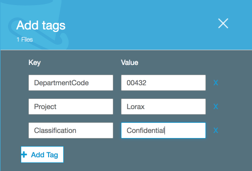
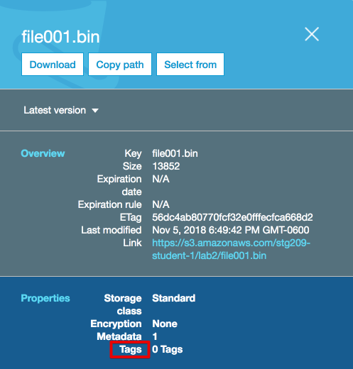
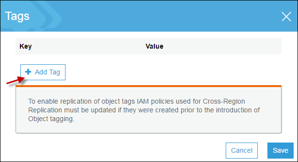
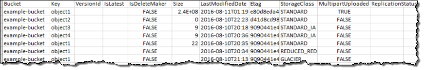

# Lab 2 - Object Tagging and Inventory

## Introduction
This lab will take you through the process of using object tagging, configuring S3 Inventory and viewing an existing inventory.

## Tagging Overview
Use object tagging to categorize storage. Each tag is a key-value pair that can be assigned during initial upload of an object or to an existing object.

 

Note the following:

 * You can associate up to 10 tags with an object. Tags associated with an object must have unique tag keys.

 * A tag key can be up to 128 Unicode characters in length and tag values can be up to 256 Unicode characters in length.

 * Key and values are case sensitive.


In addition to data classification, tagging offers other benefits such as:

 * Object tags enable fine-grained access control of permissions. For example, you could grant an IAM user permissions to read only objects with specific tags using a `Condition` in an IAM policy.
 
  ```JSON5
        "Condition": {
          "StringEquals": {
            "s3:ExistingObjectTag/security": "public"
          }
  ```

 * Object tags can be used for fine-grained object lifecycle management by specifying a tag-based filter in a lifecycle rule.  

 * When using Amazon S3 analytics, you can configure filters to group objects together for analysis by object tags, by key name prefix, or by both prefix and tags.


## Object Tagging Lab 

1. Go to the S3 console, select your S3 bucket, and go to the Lab2 prefix (folder)
2. Click to row with the first object _**file001.bin**_ to open up the object properties view. (_Note: if you clicked on the actual file name, it will open up a tabbed view.  Go to the Properties tab, then Tags box_)

3. Click on the word **Tags** to open the tag editor

 
 
4. Click the **Add Tag** button and add tags

 

 
 
5. Click **Save** then **Save Tags**

6. Your object has now been tagged.  Feel free to tag the first 3 objects. 

## Viewing Object Tags


## S3 Inventory Overview
Amazon S3 inventory provides comma-separated values (CSV) or Apache optimized row columnar (ORC) output files that list your objects and their corresponding metadata on a daily or weekly basis for an S3 bucket or a shared prefix.

You can query Amazon S3 inventory using standard SQL by using Amazon Athena, Amazon Redshift Spectrum, and other tools such as Presto, Apache Hive, and Apache Spark. It's easy to use Athena to run queries on your inventory files. You can use Athena for Amazon S3 inventory queries in all Regions where Athena is available.

The following is an example CSV inventory list opened in a spreadsheet application. The heading row is shown only to help clarify the example; it is not included in the actual list.


### 1. Step 1
When you configure an inventory list for a source bucket, you specify the destination bucket where you want the list to be stored, and whether you want to generate the list daily or weekly. You can also configure what object metadata to include and whether to list all object versions or only current versions.

Since the inventory is only generated on a daily basis, in this lab, we will setup inventory, then view an inventory that has already been created.

### Step XYZ - View An Existing Bucket Inventory
Since the inventory is only generated on a daily or weekly basis, we will view an existing inventory.
Go to this [Sample Bucket] (https://s3.console.aws.amazon.com/s3/buckets/s3reinvent2018demosourcebucketaccount1/inventory/s3reinvent2018demosourcebucketaccount1/s3reinvent2018demosourcebucketaccount1inventory/data/?region=us-east-1&tab=overview) 

If the URL doesn't work, navigate to s3reinvent2018demosourcebucketaccount1 and go into the Inventory / Data prefix (folder)

You will see a listing of GZip CSV inventory objects like this


You can download, unzip and view one of the CSV files if you wish.
It will look similar to this without the column headers


### Navigation
[Lab 3](../lab3/README.md) | 
[Back to Overview](../README.md)
