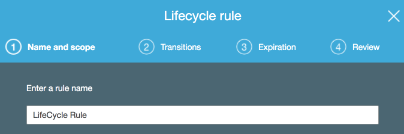
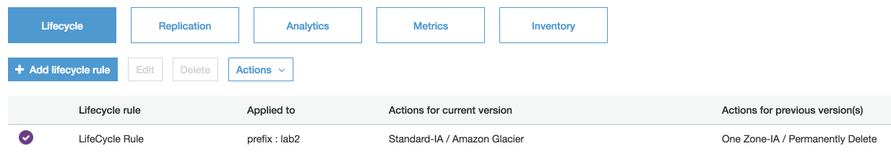

# Lab 2 - Storage Classes and Lifecycle Management

## Introduction
This lab will take you through the process of viewing and setting storage classes on an object and setting up lifecycle policies.

## Storage Classes
Every object in Amazon S3 has a storage class associated with it. By default, objects are in the STANDARD class.  When using the S3 Management Console, when you list objects in the bucket, the console shows the storage class.

Amazon S3 offers the following storage classes:

Storage Class | Durability (designed for) | Availability (designed for) | Other Considerations
------------ | ------------- | ------------ | -------------
STANDARD | 99.999999999% | 99.99% | None
STANDARD_IA | 99.999999999% | 99.9% | Suitable for infrequently accessed data.
ONEZONE_IA | 99.999999999% | 99.5% | Stored in one AZ. Suitable for infrequently accessed data
GLACIER | 99.999999999% | 99.99% (after you restore objects) | Objects must be restored before you can access them

 _Note: You cannot specify GLACIER as the storage class at the time that you create an object. You transition objects to the GLACIER storage class using lifecycle management._ 

 _Note: There is another storage class known as RRS (Reduced Redundancy Storage) but AWS recommends choosing one of the other storage classes._

Pricing for each storage class can be found on the [S3 Pricing Page](https://aws.amazon.com/s3/pricing/).

## Setting the Storage Class on an Object
Amazon S3 APIs support setting (or updating) the storage class of objects with the following methods:

* **When creating a new object** you can add the x-amz-storage-class request header to specify a storage class. If you don't add this header, Amazon S3 uses STANDARD, the default storage class.
* **Change the storage class of an existing object** by making a copy of the object using the PUT Object - Copy API.
* **Object Lifecycle Management**

### Changing the Storage Class on an Existing Object via the Console
1. Go to the [S3 console](https://s3.console.aws.amazon.com/s3/home?region=us-east-1), select your S3 bucket (e.g **stg209-student-N**), and go to the Lab2 prefix (folder)
2. Note that the first three objects have **standard** for their object class.
3. Select the checkbox to the left of the first object _**file001.bin**_ to open up the object details view

Click on **Storage Class** to bring up the **Change Storage Class** window.

Click on the radio button for **Standard-IA** and click **save** then **change**

The updated storage class will now be visible on the object overview page in the **storage class** column.

### Setting the Storage Class on an Object via AWS CLI CP Command

While it's possible to set the storage class via the S3 console, this would be cumbersome to accomplish on many files.

If you were using the AWS CLI, the storage class can easily be set with the `storage-class` parameter like this: (you do not need to do this in your lab)
    `aws s3 cp file004.bin s3://stg209-student-1/lab2/ --storage-class STANDARD_IA`

One of the most common ways to move objects between storage classes is via the built-in lifecycle policies, which is covered next.

## Object Lifecycle Management via a Lifecycle Policy
You can use lifecycle policies to define actions you want Amazon S3 to take during an object's lifetime. For example, you could transition objects to another storage class, archive them, or delete them after a specified period of time.

A lifecycle configuration is a set of rules defining actions that Amazon S3 applies to a group of objects. There are two types of actions:
 * **Transition actions** Define when objects transition to another storage class. For example, you might choose to transition objects to the STANDARD_IA storage class 30 days after you created them, or archive objects to the GLACIER storage class one year after creating them.
 * **Expiration actions** Define when objects should expire and be automatically deleted.

A versioning-enabled bucket can have many versions of the same object, one current version and zero or more non-current (previous) versions. Using a lifecycle policy, you can define actions specific to current and non-current object versions.

1. Go to the [S3 console](https://s3.console.aws.amazon.com/s3/home?region=us-east-1) and select your S3 bucket (e.g **stg209-student-N**)
2. Navigate to the **Management** tab and select **Add lifecycle rule**

3. **Give the rule a name** and add the prefix **lab2**, click **next**

4. Click the checkmarks for both **Current version** and **Previous version**
5. Next to "**for current versions of objects**" click the **+ Add Transition** link to to add a transition 
6. Select **Transition to Standard-IA after**. It will automatically select "30" for **Days after creation**
7. Add additional transitions as shown in the graphic

8. Click **Next**
9. Select **Previous Versions**

10. Click **Next**
11. Review Settings and click **Save**

12. You should now see a summary of your lifecycle policy

## Lab Complete
Congratulations!  You have completed Lab 2.

## Navigation
[Lab 3](../lab3/README.md) | 
[Back to Overview](../README.md)
