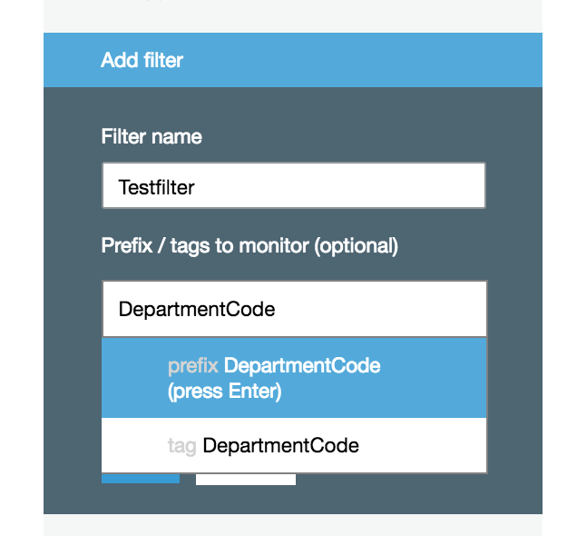
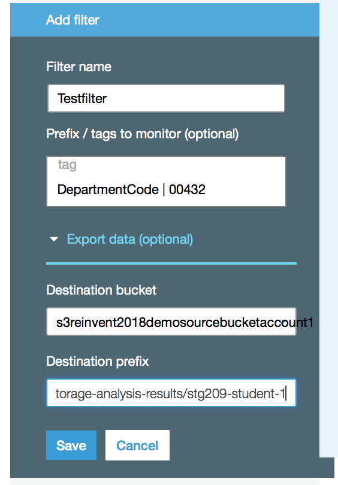

# Lab 3 - Storage Classes and Lifecycle Management

## Introduction
This lab will take you through the process of viewing and setting storage classes on an object and setting up lifecycle policies.

# Amazon S3 Analytics - Storage Class Analysis

## Introduction
This lab demonstrates the use of Amazon S3 analytics storage class analysis feature for making decisions on data life cycle management policies.

Amazon S3 analytics storage class analysis observes data access patterns and provides recommendations on when to transistion the right data to the right storage class. This new feature determines when to transition less frequently accesses data from STANDARD storage to the STANDARD_IA (IA,for infrequesnt access). For more information about storage classes, see [Storage Classes](https://docs.aws.amazon.com/AmazonS3/latest/dev/storage-class-intro.html).

You can use the storage class analysis results for improving the lifecycle policies. You can configure storage class analysis to analyze all the objects in a bucket or you can configure filters to group objects together for analysis by common prefix, by object tags or by both prefix and tags. 

Note: Storage class analysis does not give recommendations for transitions to the ONEZONE_IA or GLACIER storage classes.

You can have multiple storage class analysis filters per bucket, up to 1,000, and will receive a separate analysis for each filter. Multiple filter configurations allow you analyze specific groups of objects to improve your lifecycle policies that transition objects to STANDARD_IA.

Storage class analysis results are updated daily and are available to view from the Amazon S3 console. These results can also be exported to a file in an S3 bucket and can be used in a spreadsheet application or can be used with the business intelligence tools such as Amazon QuickSight.

You can use Amazon S3 Storage Analytics storage class analysis to:
* **Analyze the entire contents of a bucket.**
* **Analyze objects grouped together by prefix and tags.**
* **Export analysis data.**

You can use the Amazon S3 console, the REST API, or the AWS CLI or AWS SDKs to configure storage class analysis. For more information about storage class analysis, see [Amazon S3 Analytics – Storage Class Analysis](https://docs.aws.amazon.com/AmazonS3/latest/dev/analytics-storage-class.html)

## Configuring Storage Class Analysis Lab

1. Go to the S3 console, select your S3 bucket
2. Choose the Management tab, and then choose Analytics.

3. Choose Add

4.Type a name for the filter. If you want to analyze the whole bucket, leave the Prefix / tags field empty.

5.Name the filter appropriately and in the Prefix/tag filed type text for the prefix or tag for the objects that you want to analyze, or choose from the dropdown list that appears when you start typing.

6. If you chose tag, enter a value for the tag. You can enter one prefix and multiple tags. The below example TestFilter,is applied on all the objects tagged with DepartmentCode=00432.

7. On the same pane, choose Export data to export analysis reports to a comma-separated values (.csv) flat file. Specify the destination bucket as **s3reinvent2018demosourcebucketaccount1** and provide the prefix **storageanalysis/your-bucket-name>**. Here is an example showing the details for student-1 - 
  
   

Note: The destination bucket must be in the same AWS Region as the bucket for which you are setting up the analysis. The destination bucket can be in a different AWS account.

8. Choose *Save*

# Amazon S3 - Metrics Configurations for Buckets

## Introduction
This lab demonstrates the use of Amazon S3 Metrics Configurations for Buckets that enables users to recieve 1-minute Cloudwatch metrics, set Cloudwatch alarms and access near-real time Cloudwatch dashboards on operations and performance of Amazon S3.

There are two ways that you can use CloudWatch with Amazon S3. 

* **Daily Storage Metrics for Buckets** - This features provides details on the storage utilization on the bucket level. More speficically, you will be able to get details on the average amount of data stored in a buckets in bytes and total number of objects stored in a bucket. The storage metrics are available for STANDARD storage class, STANDARD_IA storage class, ONEZONE_IA, Reduced Redundancy Storage (RRS) storage class and Glacier (GLACIER) storage class.This feature is turned ON by default and is reported daily with no additional charge.

* **Request metrics** - CloudWatch request metrics for Amazon S3, lets you quickly identify and act on operational issues by providing 1-minute Cloudwatch metrics at the Amazon S3 bucket-level, by default. Cloudwatch request metrics for the objects in a bucket will be available by creating **metric configurations** for a bucket. You can also define a filter for the metrics collected using a shared prefix or object tags, allowing you to align metrics filters to specific business applications, workflows, or internal organizations.
 
For more information about the CloudWatch metrics that are available and the differences between storage and request metrics, see [Monitoring Metrics with Amazon CloudWatch](https://docs.aws.amazon.com/AmazonS3/latest/dev/cloudwatch-monitoring.html).

## Configuring Request Metrics for an S3 Bucket

1. Go to the S3 console, select your S3 bucket
2. Choose the Management tab, and then choose Metrics.

3. Choose Requests

4. From the name of your bucket in the left-side pane, choose the edit icon.

5. Choose the Request metrics check box. This also enables Data Transfer metrics.

6. Choose Save.

You have now created a metrics configuration for all the objects in an Amazon S3 bucket. About 15 minutes after CloudWatch begins tracking these request metrics, you can see graphs for the metrics in both the Amazon S3 or CloudWatch consoles. You can also define a filter so the metrics are only collected and reported on a subset of objects in the bucket. For more information, see [How Do I Configure a Request Metrics Filter?](https://docs.aws.amazon.com/AmazonS3/latest/user-guide/configure-metrics.html).

## Lab Complete

Congratulations! You have completed the lab on Amazon S3 Analytics – Storage Class Analysis.

## Lab Complete
Congratulations!  You have completed Lab 3

## Navigation
[Lab 4](../lab4/README.md) | 
[Back to Overview](../README.md)
