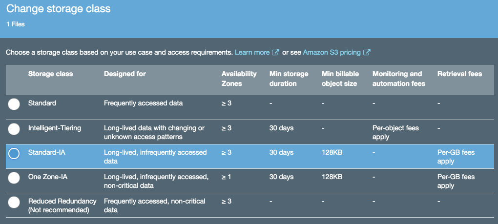

# Lab 3 - Storage Classes and Lifecycle Management

## Introduction
This lab will take you through the process of viewing and setting storage classes on an object and setting up lifecycle policies

## Storage Classes
Each object in Amazon S3 has a storage class associated with it. For example, if you list all objects in the bucket, the console shows the storage class for all the objects in the list.

Amazon S3 offers the following storage classes:

Storage Class | Durability (designed for) | Availability (designed for) | Other Considerations
------------ | ------------- | ------------ | -------------
STANDARD | 99.999999999% | 99.99% | None
STANDARD_IA | 99.999999999% | 99.9% | Suitable for infrequently accessed data.
ONEZONE_IA | 99.999999999% | 99.5% | Stored in one AZ. Suitable for infrequently accessed data
GLACIER | 99.999999999% | 99.99% (after you restore objects) | Objects must be restored before you can access them

 _Note: You cannot specify GLACIER as the storage class at the time that you create an object. You transition objects to the GLACIER storage class using lifecycle management._ 

Pricing for each storage class can be found on the [S3 Pricing Page](https://aws.amazon.com/s3/pricing/)

## Setting the Storage Class on an Object
Amazon S3 APIs support setting (or updating) the storage class of objects with the following methods:

* **When creating a new object** you can add the x-amz-storage-class request header to specify a storage class. If you don't add this header, Amazon S3 uses STANDARD, the default storage class.
* **Change the storage class of an existing object** by making a copy of the object using the PUT Object - Copy API.
* **Object Lifecycle Management**

### Changing Storage Class on an Existing Object via the Console
1. Go to the S3 console, select your S3 bucket, and go to the Lab3 prefix (folder)
2. Note that the first three objects have **standard** for their object class.
3. Click on the first object _**file001.bin**_ to open up the object details view

Click on **Storage Class** to bring up the **Change Storage Class** window
Click on the radio button for **Standard-IA** and click **save** then **change**

The updated storage class will now be visible on the object overview page under the **storage class** column

### 2. Step 2 

### 3. Step 3

### Navigation
[Lab 2](../lab2/README.md) | 
[Back to Overview](../README.md)