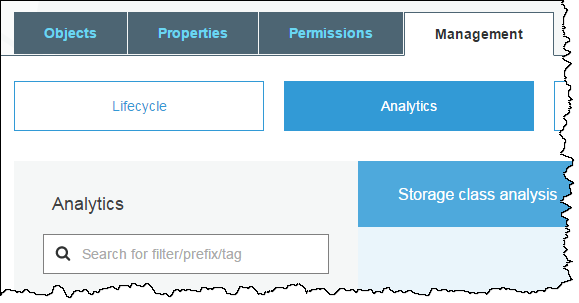

# Lab 3 - Amazon S3 Analytics and Metrics 

This is a two part lab on Amazon S3 Analytics and Metrics.

## Introduction
The first part of this lab demonstrates the use of Amazon S3 Analytics Storage Class Analysis feature for making decisions on data lifecycle management policies.

By using Amazon S3 analytics storage class analysis you can analyze storage access patterns to help you decide when to transition the right data to the right storage class. This feature determines when to transition less frequently accessed data from STANDARD storage to the STANDARD_IA (infrequent access).

You can use the storage class analysis results for improving the lifecycle policies. You can configure storage class analysis to analyze all the objects in a bucket, or you can configure filters to group objects together for analysis by common prefix, by object tags or by both prefix and tags. 

_Note: Storage class analysis does not give recommendations for transitions to the ONEZONE\_IA or GLACIER storage classes._

You can have multiple storage class analysis filters per bucket, up to 1,000, and will receive a separate analysis for each filter. Multiple filter configurations allow you to analyze specific groups of objects to improve your lifecycle policies that transition objects to STANDARD_IA.

Storage class analysis results are updated daily and are available to view from the Amazon S3 console. These results can also be exported to a file in an S3 bucket and can be used in a spreadsheet application or with business intelligence tools such as Amazon QuickSight.

You can use Amazon S3 Storage Analytics storage class analysis to:
* **Analyze the entire contents of a bucket**
* **Analyze objects grouped together by prefix and tags**
* **Export analysis data**

You can use the Amazon S3 console, the REST API, or the AWS CLI or AWS SDKs to configure storage class analysis. For more information about storage class analysis, see [Amazon S3 Analytics – Storage Class Analysis](https://docs.aws.amazon.com/AmazonS3/latest/dev/analytics-storage-class.html)

## Configuring Storage Class Analysis Lab

1. Go to the S3 console, select your S3 bucket (e.g **stg209-student-N**)
2. Choose the **Management** tab, and then choose **Analytics**.

3. Choose **Add**

4. Add a name for the filter such as _TestFilter_

5. The Prefix/tag field allows you to filter based on a prefix name or a tag value.  Type **DepartmentCode**, hit the **Down Arrow** to select "tag" and press **enter**. Type **00432** for the tag value, then hit **enter**

6. Click **Save**
7. The Storage Class Analysis will take some time to run.  Since this is a sample bucket without any live traffic, we will view a sample of existing storage class analysis in the next section.

<!--Note: The destination bucket must be in the same AWS Region as the bucket for which you are setting up the analysis. The destination bucket can be in a different AWS account.-->

## Results from Storage Class Analysis 

You will start seeing the Storage Class Analysis results in 24 to 48 hours after the initial configuration. A sample bucket has been configured with Storage Class Analysis enabled on some sample data for you to view in this lab.

1. Go to the S3 console, select the S3 bucket with the name **stg209-analyticsandmetrics-demo**

2. Choose the Management tab, and then choose **Analytics**. Review the graphs and try the filters.  

 

Storage Class Analysis usually gathers data for 30 days or more before providing recommendations on the storage class.  Here is a sample of an environment with a lot of data that is infrequently accessed and is a candidate for moving to a lower cost tier.

 

## End of part 1 in Lab 3.

# Amazon S3 - Metrics Configurations for Buckets

## Introduction

This is the second part of this lab, demonstrating the use of Amazon S3 Metrics Configurations for Buckets that enables users to recieve 1-minute Cloudwatch metrics, set Cloudwatch alarms and access near-real time Cloudwatch dashboards on operations and performance of Amazon S3.

There are two ways that you can use CloudWatch with Amazon S3. 

* **Daily Storage Metrics for Buckets** - This features provides details on the storage utilization on the bucket level. More specifically, you will be able to get details on the average amount of data stored in a bucket in bytes and total number of objects stored in a bucket. The storage metrics are available for STANDARD storage class, STANDARD_IA storage class, ONEZONE_IA, Reduced Redundancy Storage (RRS) storage class and Glacier (GLACIER) storage class. This feature is ON by default and is reported daily with no additional charge.

* **Request metrics** - CloudWatch request metrics for Amazon S3 lets you quickly identify and act on operational issues by providing 1-minute Cloudwatch metrics at the Amazon S3 bucket-level, by default. Cloudwatch request metrics for the objects in a bucket will be available by creating **metric configurations** for a bucket. You can also define a filter for the metrics collected using a shared prefix or object tags, allowing you to align metrics filters to specific business applications, workflows, or internal organizations.
 
For more information about the CloudWatch metrics that are available and the differences between storage and request metrics, see [Monitoring Metrics with Amazon CloudWatch](https://docs.aws.amazon.com/AmazonS3/latest/dev/cloudwatch-monitoring.html).

## Configuring Request Metrics for an S3 Bucket

1. Go to the S3 console, select your S3 bucket
2. Choose the Management tab, and then choose **Metrics**.

3. Choose **Requests**

4. From the name of your bucket in the left-side pane, choose the edit icon.

5. Choose the Request metrics check box. This also enables Data Transfer metrics.

6. Choose **Save**.

You have now created a metrics configuration for all the objects in an Amazon S3 bucket. About 15 minutes after CloudWatch begins tracking these request metrics, you can see graphs for the metrics in both the Amazon S3 or CloudWatch consoles. You can also define a filter so the metrics are only collected and reported on a subset of objects in the bucket. For more information, see [How Do I Configure a Request Metrics Filter?](https://docs.aws.amazon.com/AmazonS3/latest/user-guide/configure-metrics.html).

## Results from Configuration Request Metrics

About 15 minutes after CloudWatch begins tracking these request metrics, you can see graphs for the metrics in both the Amazon S3 or CloudWatch consoles. 

A sample bucket has been configured with S3 Storage Metrics already enabled and with some sample data already loaded.  

1. Go to the S3 console, select the S3 bucket with the name **stg209-analyticsandmetrics-demo**

2. Choose the Management tab, and then choose **Metrics**. 

 

3. View the various graphs that are available on the Storage tab.  Also be sure to check out the data filtered by various prefixes.

 

4. Take a look at the graphs on the **Requests and Data Transfer** tabs

 

<!--Here are some sample graphs generated by request metrics:

-->

## Lab Complete

Congratulations! You have completed Lab 3.

## Navigation
[Lab 4](../lab4/README.md) | 
[Back to Overview](../README.md)

