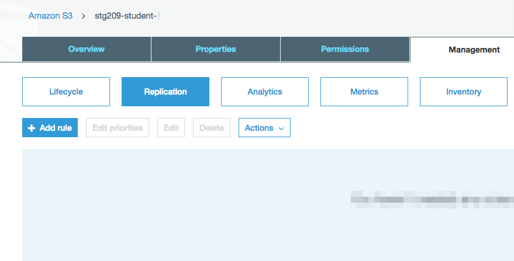

# Lab 4 - Versioning and Cross Region Replication

## Introduction
This lab will take you through the process of enabling object versioning and configuring CRR (Cross Region Replication).

## Versioning Overview
Versioning is a data protection mechanism for S3 buckets/objects. Versioning is enabled at the bucket level and is highly recommended as AWS considers it a "best practice". It can be enabled via the console or programatically. This session focuses on the console.

 

**Note the following:**

* Protects against unintended deletes (think Recycle Bin)
* No performance penalty
* Easy retrieval of deleted objects.
* Lifecycle policies assist "versioning" with variant control, clean up, and storage class mobility

## Versioning Lab

1. Go to the S3 console, select your S3 bucket **(stg209-student-x)**, click on "Properties" tab
2. Click on "Versioning", select "Enable versioning", click "Save"

 

3. Enter S3 bucket **(stg209-student-x)** and navigate to prefix (folder) **"lab4/version1"**. Click on Versions "Show" to observe the current state of the files in this folder.

 

As you can see, there is only one version of each file. Feel free to open any txt file.  It will read **"This is version 1"**

4. Re-enter the S3 bucket and navigate to the other folder **"lab4/version2"**. Select the files and click Copy.

 
 
 
5. Navigate back to folder **"lab4/version1"** and choose Actions "Paste" to write the contents to the folder.

6. Click on Versions "Show". You will notice that you now have multiple versions of the same file.

 
 
 
7. Open both versions of the same file. The "Latest" will read **"This is version 2"**. The "Older" will read **"This is version 1"**.  If you delete the "Latest" version of a file, it will promote the Older to "Latest".  

This concludes "Versioning".  Are there any questions?

## Cross Region Replication (CRR) Overview
CRR is a bucket level feature that allows for asynchronous replication of objects in different regions.  Source and destination can be same or different accounts. Only new Objects or Puts will be replicated. Deletes and Lifecycle Policies will not be replicated.  All data in transit is encrypted (SSL,TLS).

* **Use cases:** Compliance, Latency, Operational, Security.
* **Requirements:** Versioning (source/dest), Different Regions (source/dest), Permissions (replication)
* **Updates:** Overwrite ownership (two diff owners), Different storage class, Bi-directional, Independent Lifecycle Policies

## Cross Region Replication Lab

1. Versioning is required in both buckets (source/dest).  Please enable "Versioning" on your destination CRR bucket.  It will be named as follows **(stg209-crr-student-x)**.

2. Identify your **(source/dest)** buckets and ensure requirements are met **(Versioning, Diff Regions, Permissions)**.

 

3. Navigate to the "Management" tab of the source bucket and choose Relication and click on **"+ Add Rule"**

 

4. Set source to Entire bucket. Do not check "encrypted with AWS KMS". Click "Next"

 
 

5. Set Destination bucket (same account) to **(stg209-crr-student-x)**. Leave Options blank. Click "Next"

6. Configure options...Choose IAM role - "Create new role". Type Rule name - **"s3-crr-student#"**. Click "Next"

 

7. Review Source, Destination, Options and Click "Save"

 

8. Remember...CRR only replicates "new" PUTs and Objects. Copy and paste several directories to / from in your source.  You will now notice replicated files in your destination bucket.

This concludes "Cross Region Replication".  Are there any questions?
