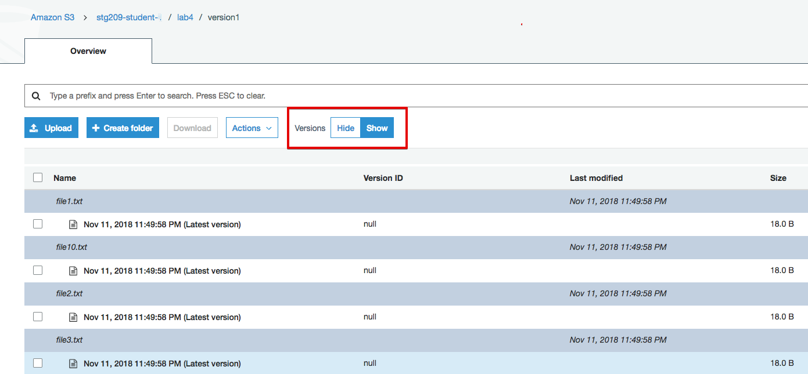

# Lab 4 - Versioning, Cross Region Replication, and Events

## Introduction
This lab will take you through the process of enabling object versioning, configuring CRR (Cross Region Replication), and facilitating event driven notifications.

## Versioning Overview
Versioning is a data protection mechanism for S3 buckets/objects. Versioning is enabled at the bucket level and is highly recommended as AWS considers it a "best practice". It can be enabled via the console or programatically. This session focuses on the console.

 

Note the following:

* Protects against unintended deletes (think Recycle Bin)
* No performance penalty
* Easy retrieval of deleted objects.
* Lifecycle policies assist "versioning" with variant control, clean up, and storage class mobility

## Versioning Lab

1. Go to the S3 console, select your S3 bucket (stg209-student-x), click on "Properties" tab
2. Click on "Versioning", select "Enable versioning", click "Save"

 

3. Enter S3 bucket (stg209-student-x) and navigate to prefix (folder) "lab4/version1". Click on Versions "Show" to observe the current state of the files in this folder.

 

As you can see, there is only one version of each file. Feel free to open any txt file.  It will read "This is version 1"

4. Re-enter the S3 bucket and navigate to the other folder "lab4/version2". Select the files and click Copy.

 
 
5. Navigate back to folder "lab4/version1" and choose Actions "Paste" to write the contents to the folder.

6. Click on Versions "Show". You will notice that you now have multiple versions of the same file.

 
 
Feel free to open both versions of the same file. The "Latest" will read "This is version 2".

This concludes "Versioning".  Are there any questions before we move on?

### Navigation
Congratulations!  You have completed all the labs!

[Back to Overview](../README.md)
